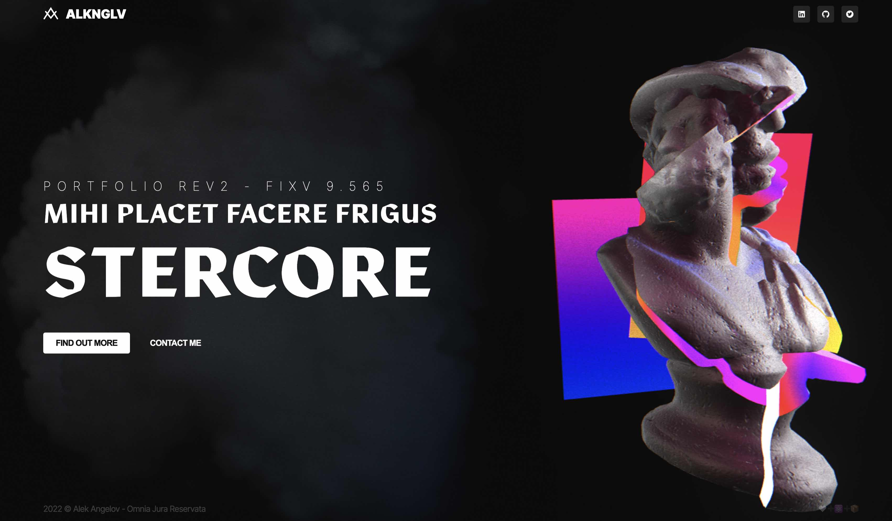

# Alek Angelov's Portfolio

An open source collection of experiments that kinda look good

## Motivation

I haven't updated my portfolio in a while. Wanted to make something that looks good and not many people can make. A wordpress template is too simple.

## Technologies

A list of the tech I used

- React - Main Renderer / UI Library
- Vanilla Extract - Styling
- Zustand
- ThreeJS + React Three Fiber
- Vercel
- Vite
